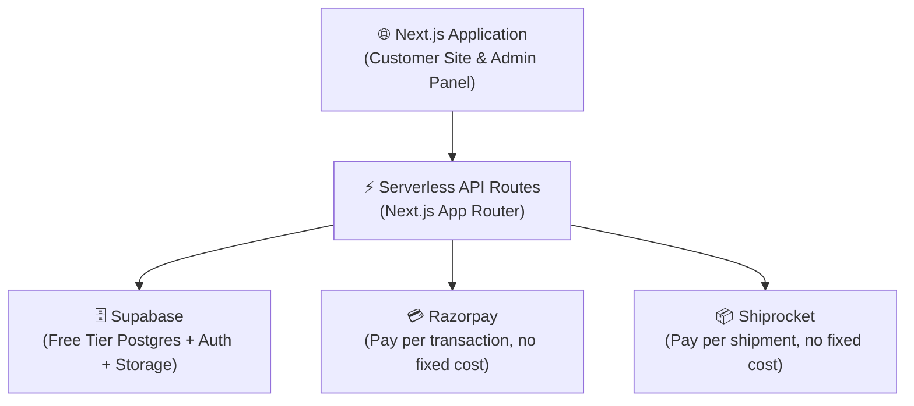

# 📋 Product Requirements Document (PRD)
# **Mithila Makhana — E-Commerce & Company Management Platform**
*(AI-Driven, Zero-Cost Implementation Strategy)*

---

| Field             | Details                                      |
|-------------------|----------------------------------------------|
| **Product Name**  | Mithila Makhana Platform                     |
| **Version**       | 2.0 (AI-Optimized)                           |
| **Date**          | June 23, 2026                                |
| **Development**   | Fully Autonomous AI Agents                   |
| **Budget**        | Negligible (Targeting Free Tiers)            |

---

## 1. Executive Summary

Mithila Makhana is a premium fox-nut (makhana) brand rooted in the Mithila region of Bihar, India — home to **GI-tagged Mithila Makhana**. This PRD outlines the requirements for building a full-stack digital platform using **AI Agents** exclusively, with a focus on **zero-cost/free-tier** infrastructure.

The platform serves two core purposes:
1. **Customer-Facing E-Commerce Website** — A modern online store to sell makhana products directly to consumers.
2. **Internal Admin Dashboard** — An admin panel to manage inventory, orders, products, and basic operations.

> [!IMPORTANT]
> The development strategy has shifted to utilize AI agents to eliminate human developer costs, and the tech stack has been optimized to run entirely on free-tier services (Vercel, Supabase).

---

## 2. Platform Architecture Overview (Zero-Cost Focus)

---

## 3. Feature Requirements (MVP Focus)

To ensure rapid AI deployment, the MVP will focus strictly on essential features.

### 🛒 Module 1: E-Commerce Storefront
- **Homepage:** Hero banner, product grid, trust badges (GI Tag, FSSAI).
- **Product Catalog:** List products, view details, select weights (e.g., 250g, 500g).
- **Shopping Cart & Checkout:** Cart state management, address collection, Razorpay integration.
- **User Authentication:** Email/Password login via Supabase Auth.
- **Order Tracking:** Simple order status view for customers.

### 📊 Module 2: Admin Dashboard
- **Dashboard:** Simple KPIs (Total Sales, Order Count).
- **Product Management:** Add/Edit/Delete products and update stock levels.
- **Order Management:** View orders, update status (Pending -> Shipped -> Delivered).
- **Basic Inventory:** Auto-deduct stock upon order placement.

---

## 4. Development Strategy (AI Agents)

Instead of a traditional human team, an **AI Coding Agent** will build the platform autonomously.

| Traditional Way | AI-Driven Way | Cost Savings |
|-----------------|---------------|--------------|
| Project Manager | You (The User) prompt the AI | ₹50k/month |
| UI/UX Designer | AI uses Tailwind + Shadcn UI | ₹40k/month |
| Frontend Dev | AI writes Next.js code | ₹60k/month |
| Backend Dev | AI configures Supabase + Serverless | ₹70k/month |
| QA Tester | AI writes tests + You verify | ₹30k/month |
| **Total Dev Cost** | | **₹0** |

---

## 5. Technology Stack (Free Tier Optimized)

| Layer | Technology | Cost / Justification |
|-------|-----------|----------------------|
| **Full Stack Framework** | Next.js (App Router) | ₹0 / Replaces separate frontend and backend. |
| **Database & Auth** | Supabase (PostgreSQL) | ₹0 (Free Tier allows 500MB DB, 2GB Bandwidth, 50k MAU). |
| **Styling** | Tailwind CSS + Shadcn UI | ₹0 / Beautiful, accessible components out of the box. |
| **Hosting** | Vercel | ₹0 (Hobby Tier) / Seamless Next.js deployment. |
| **Payments** | Razorpay | 2% per transaction (No setup fee, no monthly fee). |
| **Shipping** | Shiprocket | Pay per shipment (No monthly fee). |
| **Domain Name** | Custom Domain (.in or .com) | ~₹500 - ₹800 / year (Only unavoidable cost). |

---

## 6. Budget Estimate (Negligible)

| Category | Estimated Cost (INR) |
|----------|---------------------|
| **Development Team** | ₹0 (AI Agents) |
| **Hosting & Database** | ₹0 (Vercel & Supabase Free Tiers) |
| **Domain Name** | ₹800 / year |
| **Payment Gateway** | ₹0 setup (Pay-as-you-go) |
| **Total Upfront Cost** | **< ₹1,000** |

---

## 7. AI Timeline

Because AI agents can write code continuously without fatigue, the timeline is drastically compressed.

*   **Week 1:** Setup Supabase, Next.js, Authentication, and Product Catalog.
*   **Week 2:** Implement Cart, Checkout (Razorpay), and Order Management.
*   **Week 3:** Build Admin Dashboard and polish UI/UX.
*   **Week 4:** Testing, Vercel Deployment, and Go-Live.
